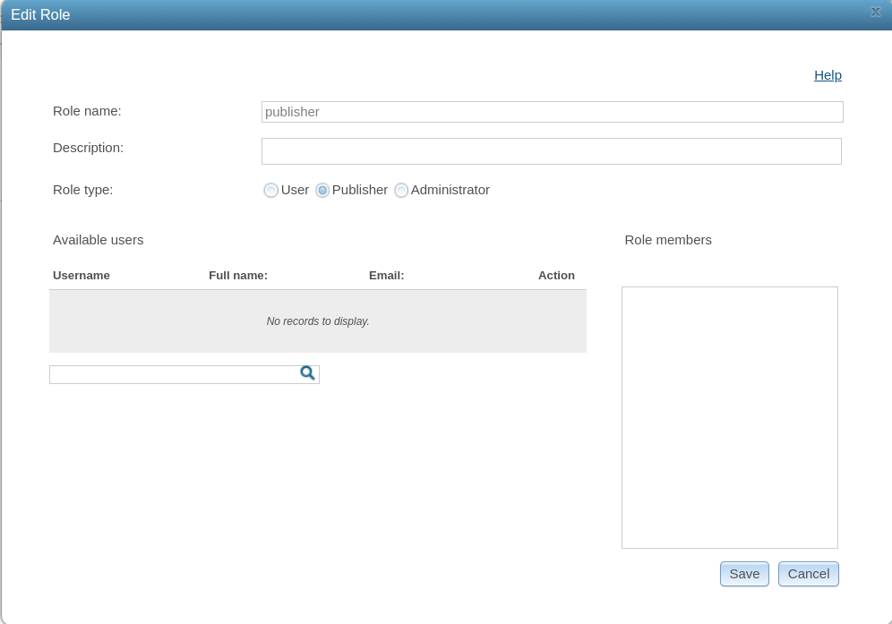
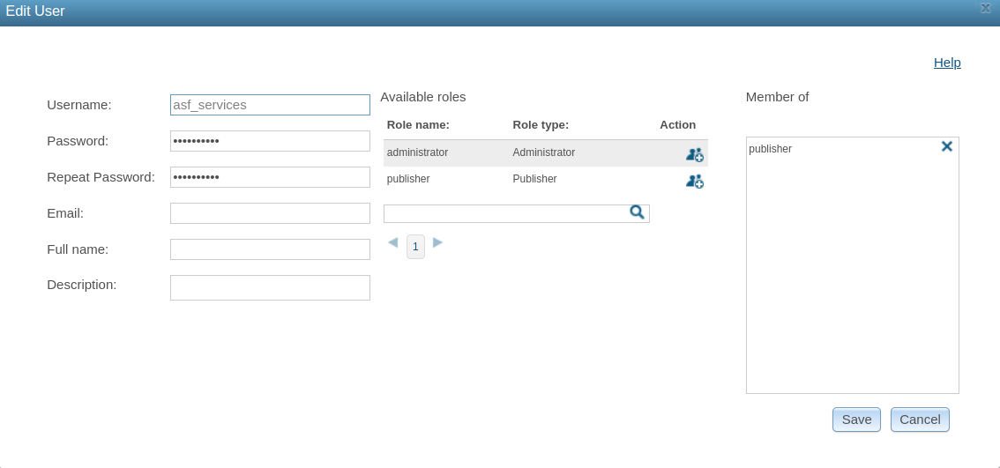

# Deploying and Configuring an ArcGIS Image Server
This document describes the workflow for deploying and configuring an ArcGIS Server with Image Server to an AWS EC2 instance.

## Server Software Types

To host ArcGIS Image Services, a server must be configured and licensed for two different ArcGIS Server products: 
1. ArcGIS Server
2. ArcGIS Image Server extension

The ArcGIS Server is the software that allows feature services to be published. A python interpreter with the arcpy package installed is included in ArcGIS Server installation. The arcpy package is used in programmatic workflows for preparing geospatial content and publishing it to ArcGIS services. The ArcGIS Server licensing also provides access to the arcpy package for any conda environments configured on the server.

The Image Server extension is required for publishing image services. This software provides support for raster mosaics that render on the fly, along with support for time-enabled mosaic datasets. This functionality has been a key component of the services ASF offers. 

### Server Functions and Configurations

We use the server environment for two critical components:
1. Running processing workflows to generate mosaic datasets and publish service definitions
2. Hosting the image services

#### Single-Server Configuration

Our current server configuration uses a single server to perform both of these functions. 

For a single-server configuration, the AWS stack configuration would include:
1. AWS EC2 instance running ArcGIS Server with the Image Server extension enabled
2. AWS Load Balancer

#### Two-Server Configuration

Because a heavy processing load can impact the reliability of the service hosted on that same server, it may be advantageous to provision separate servers for processing and hosting. 

A two-server configuration would add another EC2 instance, and partition the two core functions: 
1. AWS EC2 instance running ArcGIS Server (the "processing server")
2. AWS EC2 instance running ArcGIS Server with the Image Server extension enabled (the "image server" or hosting server)
3. AWS Load Balancer

In this two-server configuration, the processing server is used for running the scripts to generate the mosaic datasets and service definitions, but the service definitions are published to the image server for hosting.

When the processing is separated from the hosting, the services must be published from one server to another. When hosting a service, the source mosaic dataset (contained in a file gdb) must be uploaded to the host server. 

The gdb is generated on the processing server, and it is somewhat challenging to move the file to the image server. We have investigated the following approaches: 
1. Enable the "copy data to server" option in the CreateImageSDDraft command [as set in this version of the code](https://github.com/ASFHyP3/gis-services/blob/7369397cb2666dae43b0f7de3985a5fa747e42a1/image_services/rtc_services/make_rtc_service.py#L212). This copies the data over without any additional code, BUT comes at a time cost. Enabling this option increased the processing time for one of our larger test services from under 2 hours to about 6 hours. 
2. SCP from one instance to another. This would require including an scp command in the script, and providing an authentication method. One option would be to manually provision a key pair on the sending instance and add its public key to authorized_hosts on the receiving instance. We have not yet tested this approach.

## First Time Server Setup

These steps only need to be run once per AWS account.

1. Visit the [Esri AWS Marketplace](https://aws.amazon.com/marketplace/seller-profile?id=98a100e1-04d1-40b2-aa8a-619411d037d2) and search for the appropriate ubuntu AMI:
   * https://us-east-1.console.aws.amazon.com/marketplace/home?region=us-west-2#/search!mpSearch/search?text=esri+arcgis+enterprise+on+ubuntu


2. Find the desired item in the EC2 console and click on it to subscribe. 
   * As of this writing, the most recent AMI is “Esri ArcGIS Enterprise 10.9.1 on Ubuntu (April 2022)” (ami-0b1ddcef10ffe54fb)
   * You will need to log in under your organization’s account; the organization is subscribing, not the individual user.


3. Upload an SSL certificate into AWS ACM
   * The same Tools certificate can be used for any of our deployments


4. Import a public key in the AWS EC2 console by setting up a [key pair](https://docs.aws.amazon.com/AWSEC2/latest/UserGuide/ec2-key-pairs.html). 
   * Existing users can add keys for additional users so they can SSH into the instance
   * /home/ubuntu/.ssh/authorized_keys

## Deploy the stack

A CloudFormation template for this project is at https://github.com/ASFHyP3/gis-services/blob/main/image_server/cloudformation.yml and can be deployed either from the command line or the AWS CloudFormation console.

* Note that the current CloudFormation template referenced in this document is for a single-server configuration. To deploy a two-server configuration comprising both a processing and image server, use the template in [this PR](https://github.com/ASFHyP3/gis-services/pull/61).

Check for the correct ImageId, which are different across versions (i.e. different for 10.8.1 vs 10.9.1).
and choose the appropriate image for the appropriate Ubuntu version.

If setting up using the UI, go to CloudFormation and launch a new stack using new resources. Follow the steps below:

1. Upload the [CloudFormation template](cloudformation.yml)


2. Specify parameters - some hints are:
   * Bucket - S3 bucket where data are stored. Disasters data are generally stored in `hyp3-nasa-disasters`
   * CertificateARN - go to CertificateManager (in `hyp3`), find the active certificate, and copy that ARN
   * KeyName - KeyPair name for the user planning to first ssh into the instance (ex: jrsmale)


3. Keep defaults on acknowledgement page


It takes about 5 minutes to stand up the instance and load balancer. The load balancer will become more critical if we add additional servers.

## Configure the ArcGIS Server
These steps are required for all servers, regardless of whether they will be configured as processing servers or image servers.

1. Retrieve the appropriate prvc licence files on your local machine for the ArcGIS Server and Image Server from s3://hyp3-software/ and scp them to the server
```
aws s3 cp --profile hyp3 s3://hyp3-software/ . --recursive --exclude "*" --include "*.prvc"
scp ArcGISImageServer_ArcGISServer_1097915.prvc ubuntu@ec2-xx-xxx-xx-xx.us-west-2.compute.amazonaws.com:/home/ubuntu
scp ArcGISGISServerAdvanced_ArcGISServer_1097910.prvc ubuntu@ec2-xx-xxx-xx-xx.us-west-2.compute.amazonaws.com:/home/ubuntu
```
   * all servers require the ArcGISGISServerAdvanced license, but only the image server used for hosting the services requires the additional ArcGISImageServer license


2. SSH to the instance (IP address can be found in the EC2 Instance information under Public IP4)


3. Add any needed public keys to `/home/ubuntu/.ssh/authorized_keys` so that other Tools team members can ssh to the server


4. Clone the [gis-services github repository](https://github.com/ASFHyP3/gis-services/) to `/home/arcgis/` on the server
```
sudo su arcgis
cd /home/arcgis/
git clone https://github.com/ASFHyP3/gis-services/
cd gis-services
# check out the `develop` branch if on a test server; check out the `main` branch if on a production server
# git checkout main
# git checkout develop
exit
```


5. After the instance is created, wait 5-15 minutes for the initial auto-updater to finish running, then run the [root setup script](https://github.com/ASFHyP3/gis-services/blob/develop/image_server/root_setup.sh) from the github repo on the server as the root user
```
sudo su root
/bin/bash /home/arcgis/gis-services/image_server/root_setup.sh
exit
```
   * If you get an error about `/var/lib/dpkg/lock`, that means the auto-updater is still running; wait and try again later
   * Accept any default prompts during the apt installations


6. Run the [arcgis setup script](https://github.com/ASFHyP3/gis-services/blob/develop/image_server/arcgis_setup.sh) as the arcgis user to activate the ArcGIS Server licenses and apply patches to the server
```
sudo su arcgis
cd /home/arcgis/
cp /home/ubuntu/*.prvc /home/arcgis/
export SITE_PASSWORD=<new password for the siteadmin user in the manager app>
/bin/bash /home/arcgis/gis-services/image_server/arcgis_setup.sh
```

7. Restart the server 
```
sudo shutdown -r now
```

8. Configure the server based on whether it will be a [processing server](#configure-a-processing-server) or an [image server](#configure-the-image-server), as detailed in the next two sections. **If a single server is being used for both functions, follow the steps in both sections.** 


## Configure a Processing Server
These steps are only required for an ArcGIS Server that will be running processing scripts. See the [next section](#configure-the-image-server) for configuring an image server (used to host the services).

1. Download and run the mamba installer (https://mamba.readthedocs.io/en/latest/installation.html) and create the arcpy conda environment
```
wget https://github.com/conda-forge/miniforge/releases/latest/download/Mambaforge-Linux-x86_64.sh
bash Mambaforge-Linux-x86_64.sh
cd /home/arcgis/gis-services/image_server/
mamba env create -f environment.yml
```

2. Activate the arcpy conda environment and verify that the arcpy package can be imported
```
conda activate arcpy
python
import arcpy
```
   - the ArcGIS licensing must be valid to access the arcpy package
   - the first-time import for arcpy might take a couple of minutes, but if the arcpy package is not available for import, ensure that the ArcGIS Server license has been activated, and install arcpy in the arcpy conda environment once the license has been successfully applied

3. As the arcgis user, create and edit a server_connection.json file in /home/arcgis/ and populate it with the following information (refer to AWS Secrets Manager for username and password):
```
{
    "url": "https://name-of-image-server.asf.alaska.edu/arcgis/admin",
    "username": "<username>",
    "password": "<password>"
}
```


## Configure the Image Server
These steps are only required for an ArcGIS Server that will be hosting image services. See the [previous section](#configure-a-processing-server) for configuring a server to run processing scripts.

1. Find the “DNS name” for the new Load Balancer in the AWS EC2 console, e.g. gis-s-LoadB-OT2TD55ZH0GC-1897588225.us-west-2.elb.amazonaws.com


2. Create an asf.alaska.edu DNS entry for the load balancer. DNS CNAME records are managed in ASF’s gitlab in the puppet project at https://gitlab.asf.alaska.edu/operations/puppet/-/blob/production/site/modules/dns/files/asf.alaska.edu.db#L112


3. Visit the server URL and log in with the siteadmin credentials:
```
https://<load balancer dns name>/arcgis/manager/
```
or
```
https://<asf dns name>.asf.alaska.edu/arcgis/manager/
```

4. Create an administrator role 
   1. Security -> roles -> new role
   

5. Create a publisher role
   

6. Create admin user accounts 
   1. Security -> users -> new user
   
   2. Make sure to add administrator role to each user
   3. Once you have an individual account, logout from siteadmin and log in as your individual user

7. Create an `asf_services` publisher user
   

## References 

https://enterprise.arcgis.com/en/server/latest/install/linux/install-arcgis-server-on-one-machine.htm

Tools NASA Disasters GitHub repo:
https://github.com/ASFHyP3/hyp3-nasa-disasters/tree/main/update_image_services
