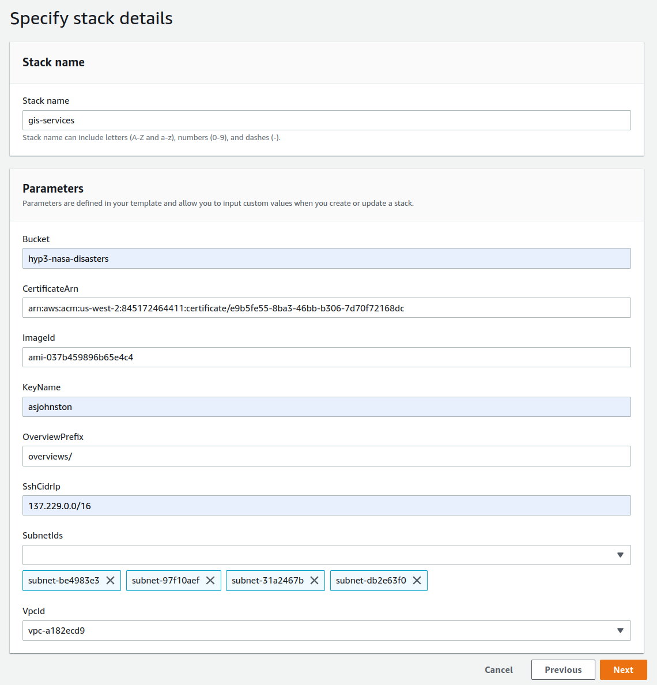
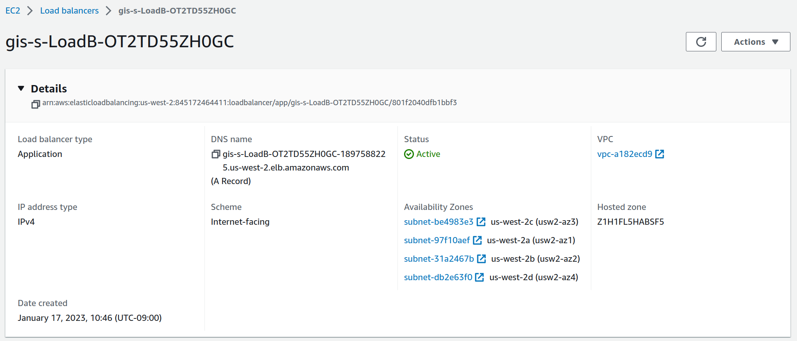
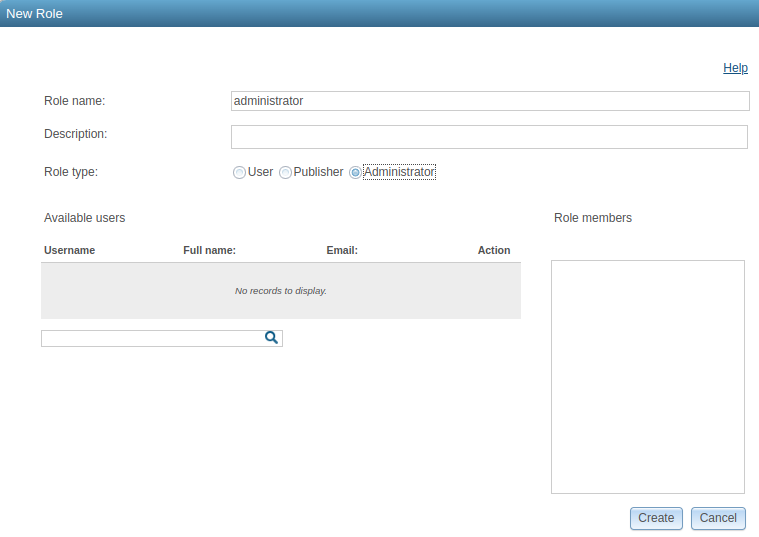
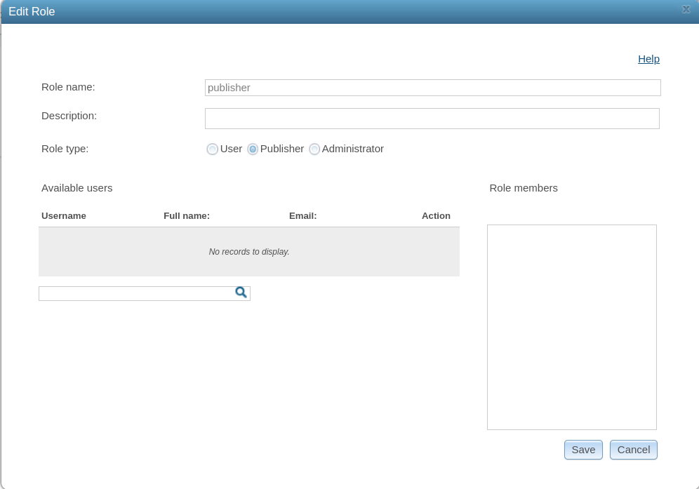
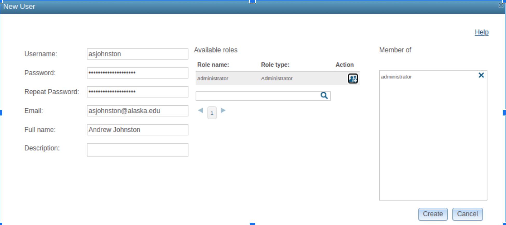
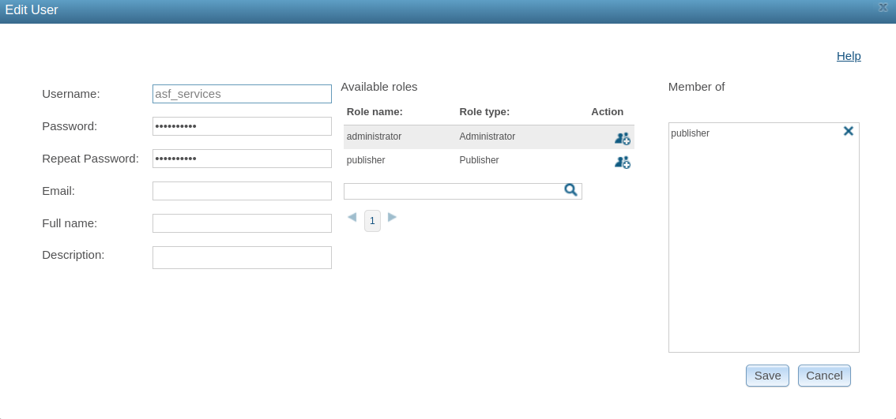

# Deploying and Configuring ArcGIS Server
This document describes the workflow for deploying and configuring ArcGIS Server to an AWS EC2 instance running Ubuntu 24.04.

## ArcGIS Server

ArcGIS Server supports the publication of geospatial data to feature and map services. A python interpreter including the arcpy package is installed during the ArcGIS Server installation process. The arcpy package is used in programmatic workflows for preparing geospatial content and publishing it to ArcGIS services. Once the ArcGIS Server license is activated, any conda environments configured on the server will also have access to the arcpy package.

### Server Functions and Configuration

We use the server environment for two critical components:
1. Running processing workflows to generate mosaic datasets and publish service definitions
2. Hosting the image services

Our current server configuration uses a single server to perform both of these functions. The AWS stack configuration includes:
1. AWS EC2 instance running ArcGIS Server
2. AWS Load Balancer

## First Time Server Setup

These steps only need to be run once per AWS account.

1. Upload an SSL certificate into AWS ACM
   * The same Tools certificate can be used for any of our deployments

2. Import a public key in the AWS EC2 console by setting up a [key pair](https://docs.aws.amazon.com/AWSEC2/latest/UserGuide/ec2-key-pairs.html). 
   * Existing users can add keys for additional users so they can SSH into the instance
   * /home/ubuntu/.ssh/authorized_keys

## Deploy the stack

A CloudFormation template for this project is at https://github.com/ASFHyP3/gis-services/blob/main/image_server/cloudformation.yml and can be deployed either from the command line or the AWS CloudFormation console.

If setting up in a browser, go to the CloudFormation service in the AWS console and create a new stack using new resources. Follow the steps below:

1. Upload the [CloudFormation template](cloudformation.yml)

2. Specify parameters - some hints are:
   * CertificateARN - go to CertificateManager (in `hyp3`), find the active certificate, and copy that ARN
   * KeyName - KeyPair name for the user planning to first ssh into the instance (ex: jrsmale)

3. Keep defaults on acknowledgement page



It takes about 5 minutes to stand up the instance and load balancer.

## Configure the ArcGIS Server

1. SSH to the instance (IP address can be found in the EC2 Instance information under Public IP4)

1. Clone the [gis-services github repository](https://github.com/ASFHyP3/gis-services/) to `/home/ubuntu/` on the server
```
cd /home/ubuntu/
git clone https://github.com/ASFHyP3/gis-services/
cd gis-services
# check out the `develop` branch if on a test server; check out the `main` branch if on a production server
# git checkout main
# git checkout develop
```

2. Run the server setup script
```
cd /home/ubuntu/
./gis-services/image_server/server_setup.sh
```

3. Add any needed public keys to `/home/ubuntu/.ssh/authorized_keys` so that other Tools team members can ssh to the server

4. Schedule scripts to run

## Set up the ArcGIS Manager web application

1. Find the “DNS name” for the new Load Balancer in the AWS EC2 console, e.g. gis-s-LoadB-OT2TD55ZH0GC-1897588225.us-west-2.elb.amazonaws.com



2. Create an asf.alaska.edu DNS entry for the load balancer. DNS CNAME records are managed in ASF’s gitlab in the puppet project at https://gitlab.asf.alaska.edu/operations/puppet/-/blob/production/site/modules/dns/files/asf.alaska.edu.db#L112

3. Visit the server URL and log in with the siteadmin credentials:
```
https://<load balancer dns name>/arcgis/manager/
```
or
```
https://<asf dns name>.asf.alaska.edu/arcgis/manager/
```

4. Create an administrator role 
   1. Security -> roles -> new role
   

5. Create a publisher role
   

6. Create admin user accounts 
   1. Security -> users -> new user
   
   2. Make sure to add administrator role to each user
   3. Once you have an individual account, logout from siteadmin and log in as your individual user

7. Create an `asf_services` publisher user
   

## References 

https://enterprise.arcgis.com/en/server/latest/install/linux/install-arcgis-server-on-one-machine.htm

Tools NASA Disasters GitHub repo:
https://github.com/ASFHyP3/hyp3-nasa-disasters/tree/main/update_image_services
