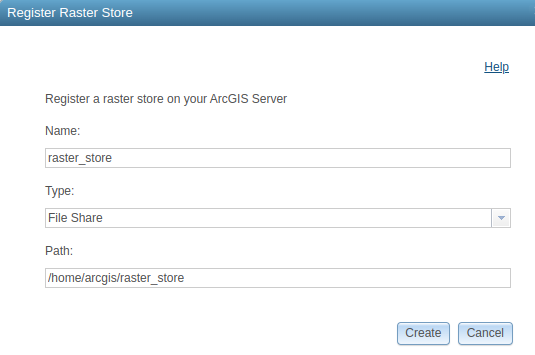

# Deploying and Configuring an ArcGIS Image Server
This document describes the workflow for deploying and configuring an ArcGIS Server with Image Server to an AWS EC2 instance.

## First Time Setup

These steps only need to be run once per AWS account.

1. Visit the [Esri AWS Marketplace](https://aws.amazon.com/marketplace/seller-profile?id=98a100e1-04d1-40b2-aa8a-619411d037d2) and search for the appropriate ubuntu AMI:
   * https://us-east-1.console.aws.amazon.com/marketplace/home?region=us-west-2#/search!mpSearch/search?text=esri+arcgis+enterprise+on+ubuntu
2. Find the desired item in the EC2 console and click on it to subscribe. 
   * As of this writing, the most recent AMI is “Esri ArcGIS Enterprise 10.9.1 on Ubuntu (April 2022)” (ami-0b1ddcef10ffe54fb)
   * You will need to log in under your organization’s account; the organization is subscribing, not the individual user.

3. Upload an SSL certificate into AWS ACM
   * The same Tools certificate can be used for any of our deployments

4. Import a public key in the AWS EC2 console by setting up a [key pair](https://docs.aws.amazon.com/AWSEC2/latest/UserGuide/ec2-key-pairs.html). 
   * Existing users can add keys for additional users so they can SSH into the instance
   * /home/ubuntu/.ssh/authorized_keys

## Deploy the stack

CloudFormation template is at https://github.com/ASFHyP3/hyp3-nasa-disasters/blob/main/update_image_services/image_server_cloudformation.yml and can be deployed either from the command line or the AWS CloudFormation console.

Check for the correct ImageId, which are different across versions (i.e. different for 10.8.1 vs 10.9.1).
and choose the appropriate image for the appropriate Ubuntu version.

If setting up using the UI, go to CloudFormation and launch a new stack using new resources. Follow the steps below:

1. Upload the [CloudFormation template]()

2. Specify parameters - some hints are:
   * Bucket - S3 bucket where data are stored. Disasters data are generally stored in `hyp3-nasa-disasters`
   * CertificateARN - go to CertificateManager (in `hyp3`), find the active certificate, and copy that ARN
   * KeyName - KeyPair name for the user planning to first ssh into the instance (ex: jrsmale)

3. Keep defaults on acknowledgement page


It takes about 5 minutes to stand up the instance and load balancer. The load balancer will become more critical if we add additional servers.

## Configure the Server

1. Retrieve the appropriate prvc licence files from s3://hyp3-software/ and scp them to the server.
```
Aws s3 –profile hyp3 s3://hyp3-software/ . –recursive –exclude “*” –include “*.prvc”
scp ArcGISImageServer_ArcGISServer_1097915.prvc ubuntu@ec2-34-210-78-89.us-west-2.compute.amazonaws.com:/home/ubuntu
scp ArcGISGISServerAdvanced_ArcGISServer_1097910.prvc ubuntu@ec2-34-210-78-89.us-west-2.compute.amazonaws.com:/home/ubuntu
```
2. Ssh to the instance (IP address can be found in the EC2 Instance information under Public IP4)
3. Add any needed public keys to `/home/ubuntu/.ssh/authorized_keys` so that other Tools team members can ssh to the server
4. After the instance is created, wait 5-15 minutes for the initial auto-updater to finish running, then copy the [root setup script](https://github.com/ASFHyP3/gis-services/blob/develop/image_server/root_setup.sh) to the server and run it as the root user. If you get an error about `/var/lib/dpkg/lock`, that means the auto-updater is still running; wait and try again later.
```
sudo su root
/bin/bash root_setup.sh
```
   Accept any default prompts during the apt installations. 
5. Copy the [arcgis setup script](https://github.com/ASFHyP3/gis-services/blob/develop/image_server/arcgis_setup.sh) to the server and run it as the arcgis user.
```
sudo su arcgis
cd /home/arcgis/
cp /home/ubuntu/*.prvc /home/arcgis/
export SITE_PASSWORD=<new password for the siteadmin user in the manager app>
/bin/bash arcgis_setup.sh
```
6.  Restart the server 
```
sudo shutdown -r now
```

## Configure the Image Server
1. Find the “DNS name” for the new Load Balancer in the AWS EC2 console, e.g. gis-s-LoadB-OT2TD55ZH0GC-1897588225.us-west-2.elb.amazonaws.com


2. Create an asf.alaska.edu DNS entry for the load balancer. DNS CNAME records are managed in ASF’s gitlab in the puppet project at https://gitlab.asf.alaska.edu/operations/puppet/-/blob/production/site/modules/dns/files/asf.alaska.edu.db#L112
3. Visit the server URL
```
https://<load balancer dns name>/arcgis/manager/
```
or
```
https://<asf dns name>.asf.alaska.edu/arcgis/manager/
```
and log in with the siteadmin credentials.
4. Create an administrator role 
   1. Security -> roles -> new role
   
5. Create admin user accounts 
   1. Security -> users -> new user
   2. Make sure to add administrator role to each user
   3. Once you have an indiviual account, logout from siteadmin and log in as your individual user
   
6. Register raster store 
   1. Site -> data stores -> register -> raster store
      
   The raster_store is just a directory on the server path, so we can use the File Share type.

## References 

https://enterprise.arcgis.com/en/server/latest/install/linux/install-arcgis-server-on-one-machine.htm

Tools NASA Disasters GitHub repo:
https://github.com/ASFHyP3/hyp3-nasa-disasters/tree/main/update_image_services
