# Publishing and Updating Web Maps in EGIS

Web maps presenting services published to EGIS should be published in the EGIS Portal. This documentation will use the GSSICB dataset as an example to walk through the workflow.

## Publish a New Web Map in EGIS

1. Navigate to https://gis.earthdata.nasa.gov/portal/home/ and log in with the ASF_Publisher credential for the production portal.
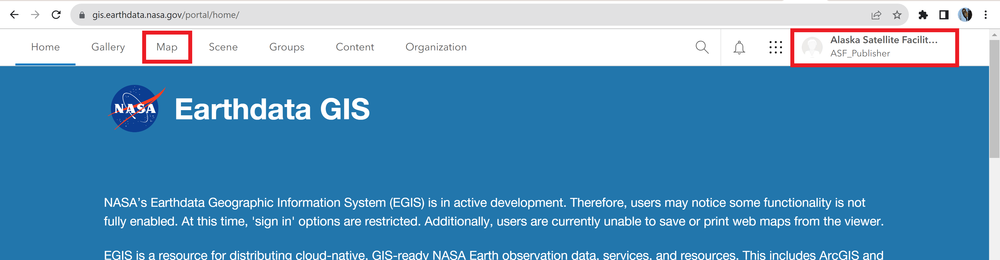
2. Click on the **Map** tab to open a blank Web Map
3. Click the link to open the map in Map Viewer
   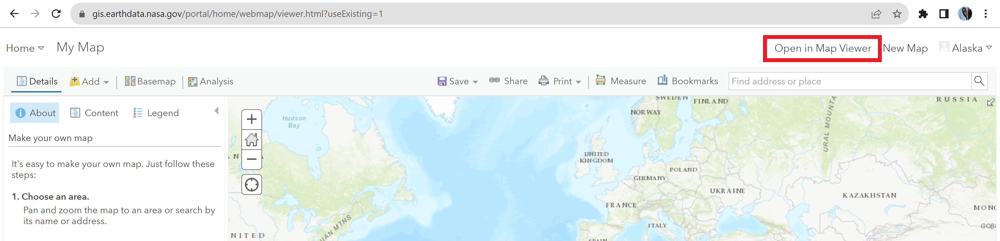
4. Click on the **Save and Open** icon and choose the **Save As** option
   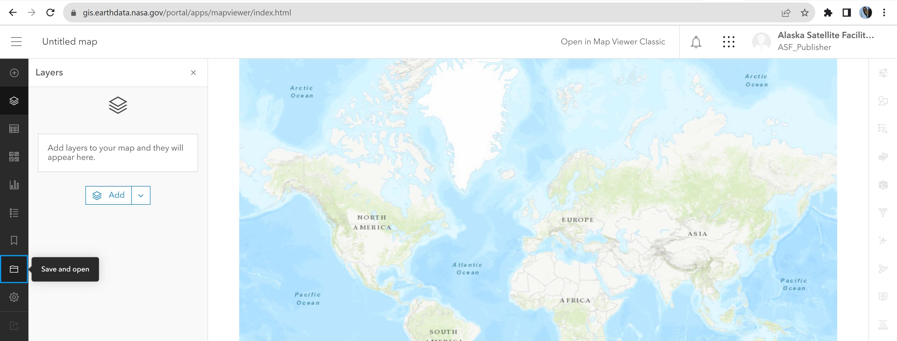
5. Complete the fields in the **Save map** dialog box, and click the **Save** button
   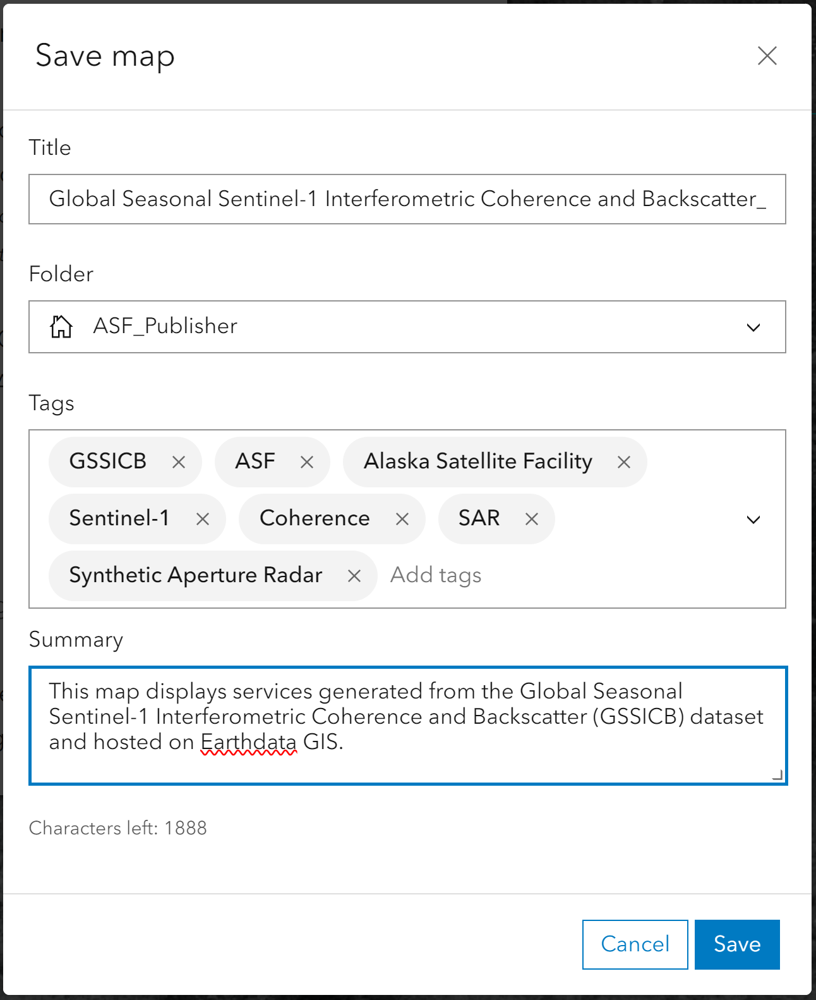

By default, the sharing settings will be for the owner of the map only. Do not change these share settings until the map is ready for public use. Refer to the [Share a Web Map section](#share-a-web-map) for sharing instructions.

## Add Services to a Web Map

Once a GSSICB image service has been published and shared with the public, it should be added to the [Global Seasonal Sentinel-1 Interferometric Coherence and Backscatter webmap](https://gis.earthdata.nasa.gov/portal/apps/mapviewer/index.html?webmap=fe536528ccf341159ef9ad4a50b1c94e).

To ensure that the services are all presented consistently, use the following workflow.

*Use the **Save** button frequently when working with the map, so that you don't lose your work if something causes an interruption or browser refresh.*

### Add Layer from URL

1. Click the layers icon in the map
   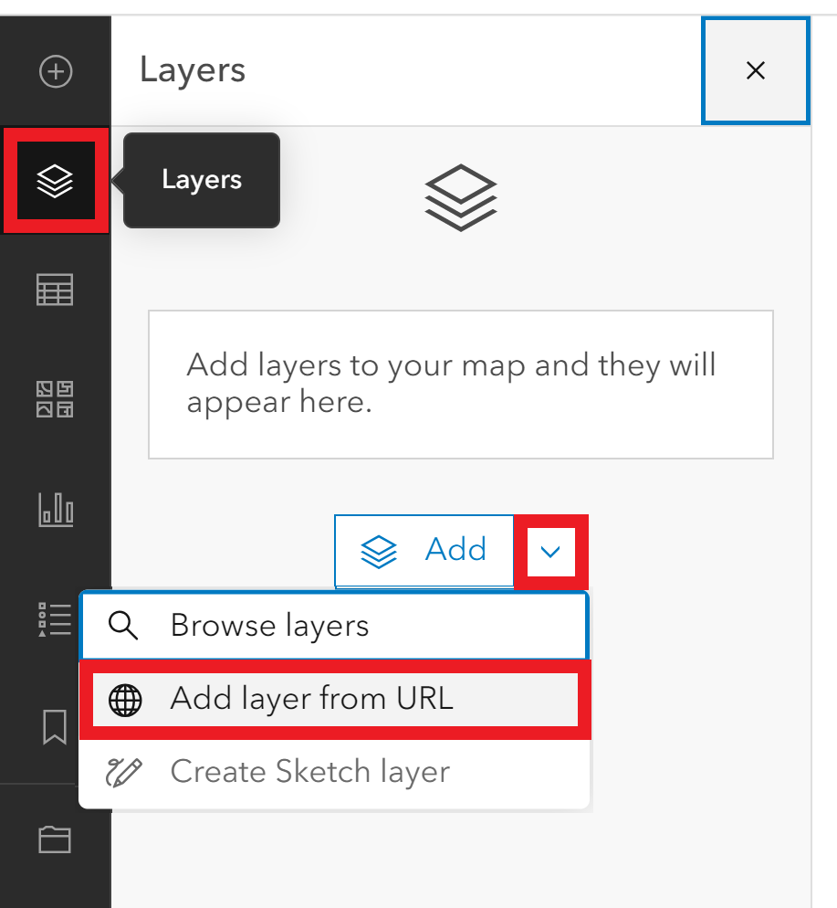
2. Click the drop-down icon next to the **Add** button, and select the option to **Add layer from URL**
3. Enter the URL for the service REST endpoint in the URL field, and click the **Add to map** button
   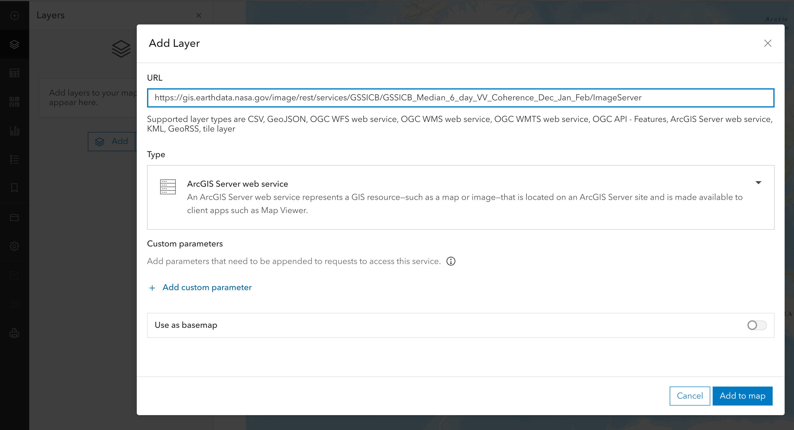
   - You can find the service URL by searching for the service in the portal, opening the Item Description, and either scrolling to the bottom and clicking the **Copy** button in the URL section or clicking the link to the REST endpoint in the Layers section.
   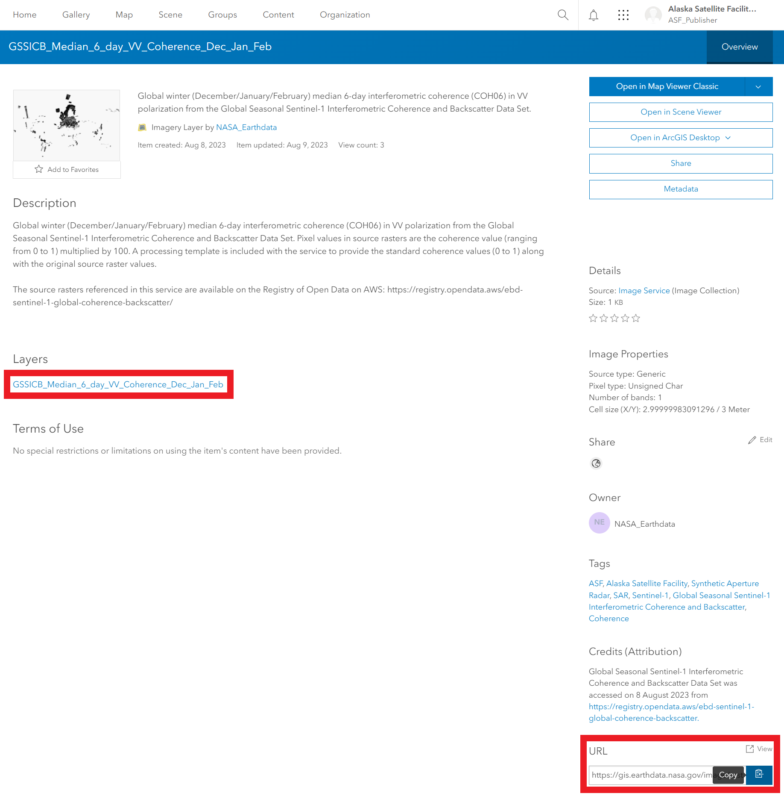

### Create a Layer Group

The GSSICB services are grouped by season. When adding the first service of a given data type, create a group will also contain the other three seasons for that data type once they are added.

1. Click the dots next to the layer name and select **Group** from the list of options
   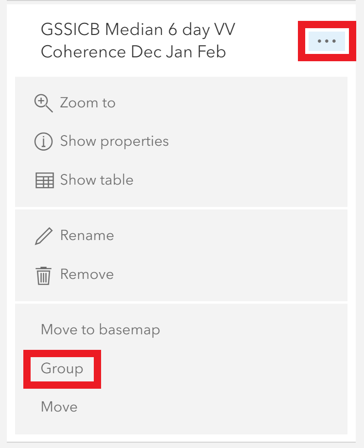
2. Click the dots next to the group name, select **Rename** from the list of options, and enter the desired group title
   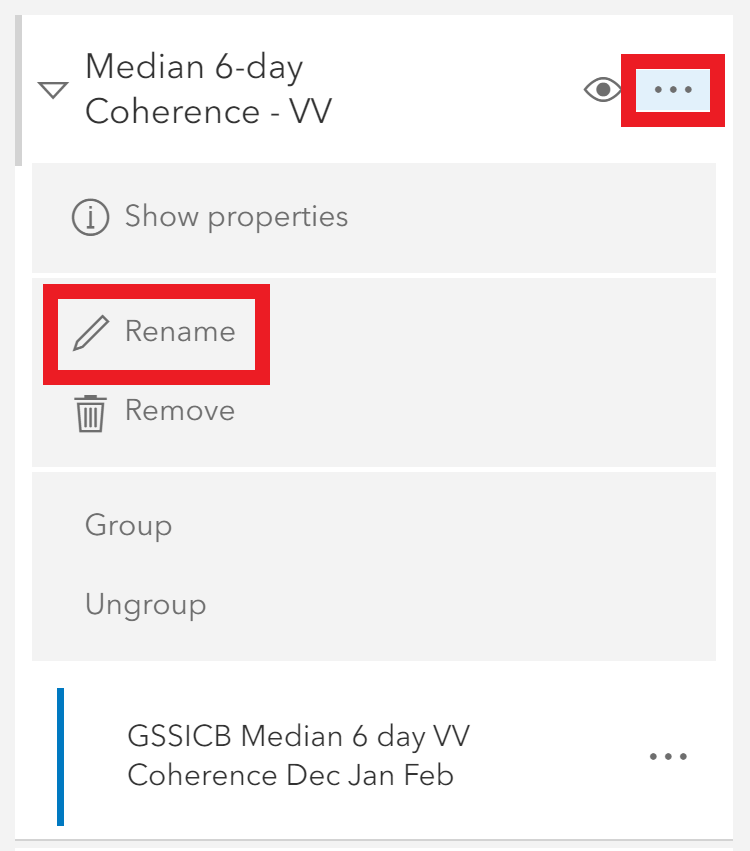
3. Add the services for the remaining seasons in the group using the steps in the [Add Layer from URL section](#add-layer-from-url) , and drag and drop the layers to add them into the group in seasonal order: 
   - Dec/Jan/Feb
   - Mar/Apr/May
   - Jun/Jul/Aug
   - Sep/Oct/Nov
   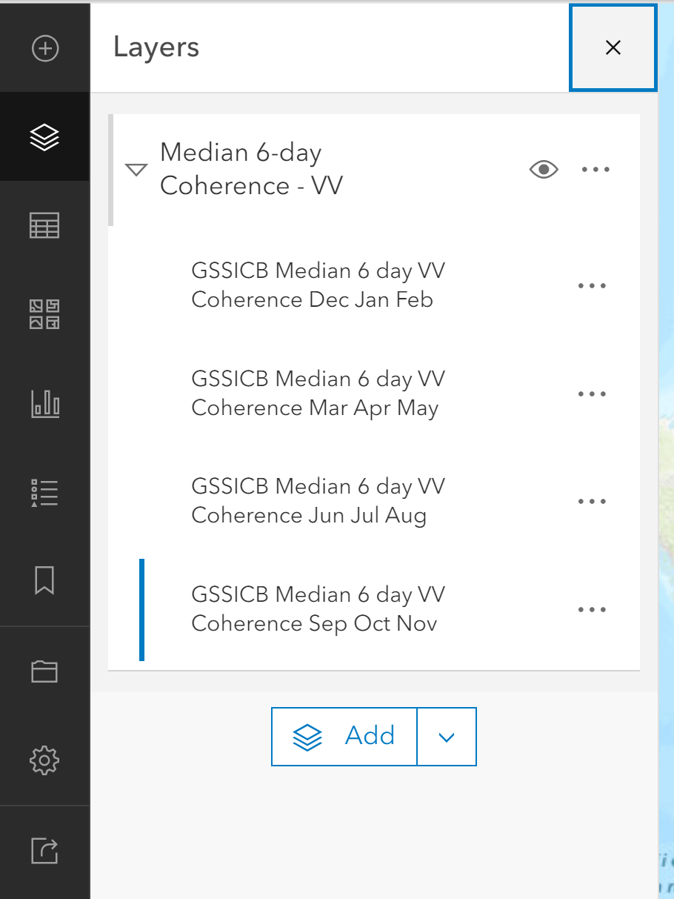

### Set Field Properties

In most cases, the properties for numeric fields will need to be edited to display the desired number of decimal places in the pop-ups. Numeric fields tend to default to 0 decimal places in the new Map Viewer, which is problematic for values such as backscatter or unscaled coherence. 

1. Click on a layer once so that it is highlighted with a blue line along the left edge
   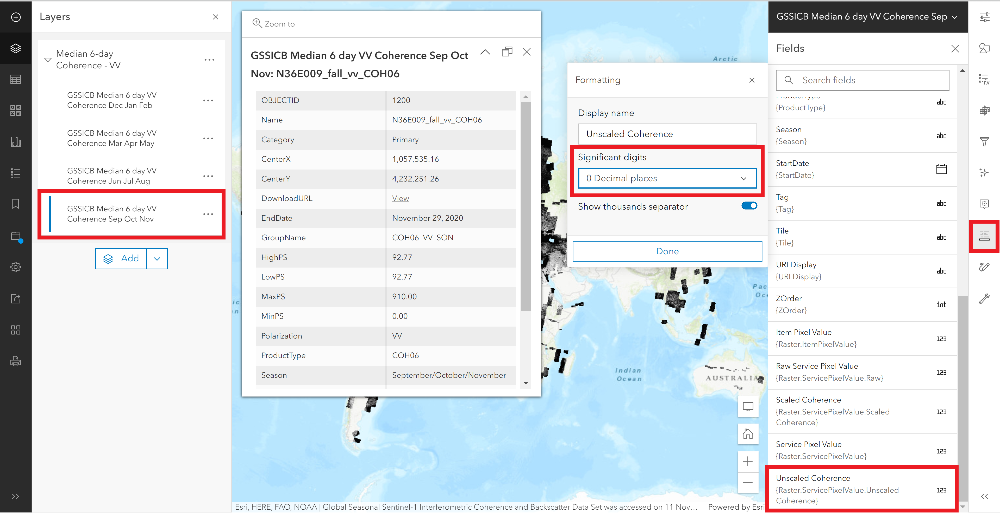
2. Click on the **Fields** icon in the panel along the far right of the browser window, and select the field that requires the settings to be changed
   - for GSSICB services, only the Unscaled Coherence field will need to be adjusted
3. Use the dropdown menu under **Significant digits** to set the desired number of decimal places to be displayed
   - for GSSICB services, the Unscaled Coherence field should be set to display 2 decimal places
4. Click the Done button to apply the settings

### Format Pop-Ups

We use formatted text for displaying the information in pop-ups in our webmaps. This allows us to customize the display and provide more guidance and supporting information than simply displaying the list of fields and their values.

1. Click on a layer in the Layers pane to highlight it with a blue line along the left edge
   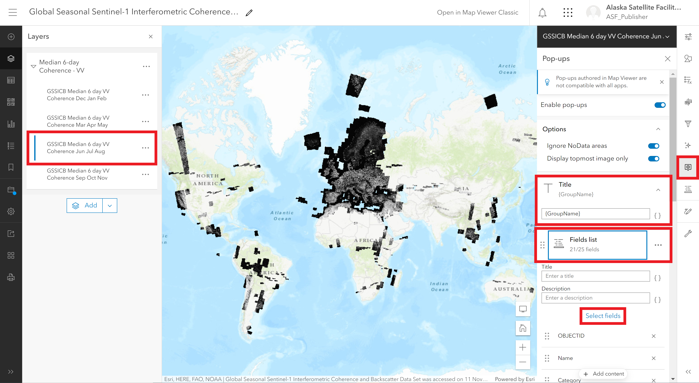
2. Click on the **Pop-ups** icon in the panel along the far right of the browser window to open the settings pane
3. Click on the dropdown arrow on the right side of the **Title** box, and replace the contents of the Title field with code to display the contents of the **GroupName** attribute field (as shown in the above illustration)
   1. The GroupName field can be typed in directly: `{GroupName}`
   2. You can click the **{ }** icon to select the GroupName field from the list
4. Click on the **Fields list** box to expand it, and click the **Select fields** link
5. Click the **Select All** button, then click the **Deselect All** button that replaces it, then click the **Done** button at the bottom of the fields window once all of the fields have been deselected
   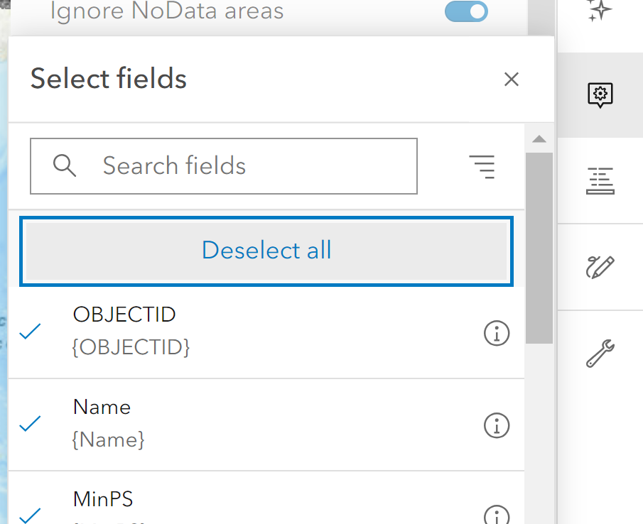
   - in ArcGIS Online, it is possible to click the three dots on the right side of the Fields list box and delete that component from the Pop-up contents entirely, but that functionality does not appear to be enabled for web maps published in the EGIS Portal
   - deselecting all of the fields is a workaround for the Portal interface that provides the same outcome, but in a less convenient way
6. Click the **Add Content** button at the bottom of the Pop-up window and select **Text** from the list
   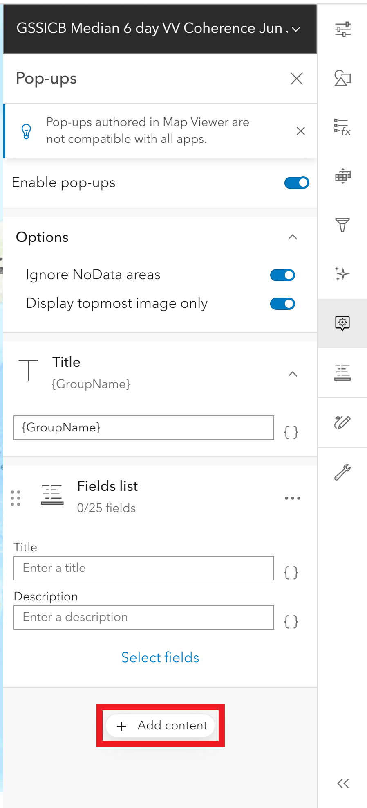
7. Populate the text window with the desired formatted information to display in the pop-up
   - In ArcGIS Online, content can easily be copied from another layer, even if it's in another map, as long as both maps use the same map viewer interface (Map Viewer Classic or the new standard Map Viewer). 
   - This copy-paste approach can be used in the EGIS Portal, but **ONLY** if the content is being copied from pop-ups in a map generated in AGOL rather than the portal, and you'll need to access the source code rather than opening the text content block and copying the formatted text. 
   1. Copy the desired content
      - ***Copy Option 1:*** Copy pop-up content from a layer in an AGOL-generated web map that has already been configured for pop-ups:
         1. In the **Layers** pane, select the layer with a configured pop-up and click on the **Pop-ups** icon in the right pane (if necessary)
         2. Click on the **Text** box in the Pop-ups window to expand it
         3. Click on the grey cell of formatted text to open it
         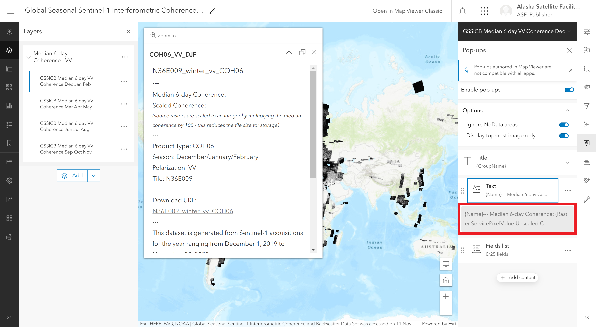
         4. Click the **Source** icon
         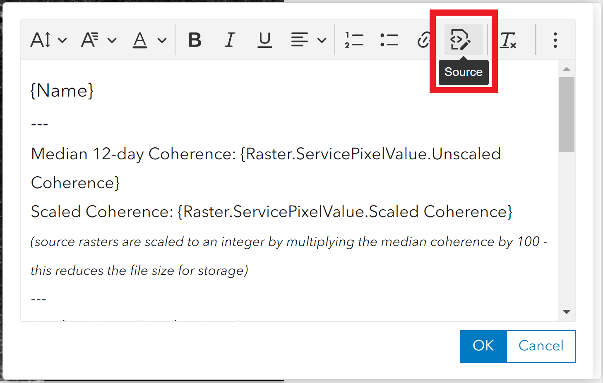
         5. Select and copy the code, then click the **Cancel** button 
            - In ArcGIS Online, content copied and pasted from the text of another pop-up will retain its formatting (including weblinks), making it very easy to populate the pop-up for a new layer, but when pasting into the EGIS Portal you need to use the source code in order to retain the hyperlinks when you copy the content from one pop-up template to another.
      - ***Copy Option 2:*** Use the following source code for COH06. Amend it as appropriate for the specific service, then copy it for use:
         ```commandline
         <p>
           <span style="font-size:large;">{Name}</span>&nbsp;
           <br>
           <span style="font-size:large;">---&nbsp;</span>&nbsp;
           <br>
           <span style="font-size:medium;">Median 6-day Coherence: {Raster.ServicePixelValue.Unscaled Coherence}</span>&nbsp;
           <br>
           <span style="font-size:medium;">Scaled Coherence: {Raster.ServicePixelValue.Scaled Coherence}</span>&nbsp;
           <br>
           <span style="font-size:small;"><i>(source rasters are scaled to an integer by multiplying the median coherence by 100 - this reduces the file size for storage)</i></span>&nbsp;
           <br>
           <span style="font-size:medium;">---&nbsp;</span>&nbsp;
           <br>
           <span style="font-size:medium;">Product Type: {ProductType}</span>&nbsp;
           <br>
           <span style="font-size:medium;">Season: {Season}</span>&nbsp;
           <br>
           <span style="font-size:medium;">Polarization: {Polarization}</span>&nbsp;
           <br>
           <span style="font-size:medium;">Tile: {Tile}</span>&nbsp;
           <br>
           <span style="font-size:medium;">---&nbsp;</span>&nbsp;
           <br>
           <span style="font-size:medium;">Download URL:&nbsp;</span>&nbsp;
           <br>
           <a href="{DownloadURL}" target="_blank"><span style="font-size:medium;">{URLDisplay}</span></a><span style="font-size:medium;">&nbsp;</span>&nbsp;
           <br>
           <span style="font-size:medium;">---</span>&nbsp;
           <br>
           <span style="font-size:medium;">This dataset is generated from Sentinel-1 acquisitions for the year ranging from December 1, 2019 to November 20, 2020.&nbsp;</span>&nbsp;
           <br>
           <a target="_blank" rel="noopener noreferrer" href="https://sentinel.esa.int/web/sentinel/missions/sentinel-1"><span style="font-size:medium;">Sentinel-1</span></a><span style="font-size:medium;">&nbsp;is a C-band SAR mission developed by ESA. This dataset contains&nbsp;modified Copernicus Sentinel data 2019-2020, processed by ESA.</span>&nbsp;
           <br>
           <span style="font-size:medium;">---</span>&nbsp;
           <br>
           <span style="font-size:medium;">The&nbsp;</span><a target="_blank" rel="noopener noreferrer" href="https://registry.opendata.aws/ebd-sentinel-1-global-coherence-backscatter/"><span style="font-size:medium;">Global Seasonal Sentinel-1 Interferometric Coherence and Backscatter Data Set</span></a><span style="font-size:medium;">&nbsp;was developed by&nbsp;</span><a target="_blank" rel="noopener noreferrer" href="https://earthbigdata.com/"><span style="font-size:medium;">Earth Big Data LLC</span></a><span style="font-size:medium;">&nbsp;and&nbsp;</span><a target="_blank" rel="noopener noreferrer" href="https://www.gamma-rs.ch/"><span style="font-size:medium;">Gamma Remote Sensing AG</span></a><span style="font-size:medium;">, under contract for&nbsp;</span><a target="_blank" rel="noopener noreferrer" href="https://jpl.nasa.gov/"><span style="font-size:medium;">NASA's Jet Propulsion Laboratory</span></a><span style="font-size:medium;">.</span>
         </p>
         ```
   2. Paste content into the **Text** component of the layer to be configured
      1. Click on the layer to be configured (and click on the Pop-ups icon if necessary)
      2. Click on the **Text** box in the Pop-ups window and click the **Click here to add text** box
      3. Click the **Source** icon
      4. Paste the source code from the other pop-up
      5. Click the **Source** button again, then click the **OK** button
         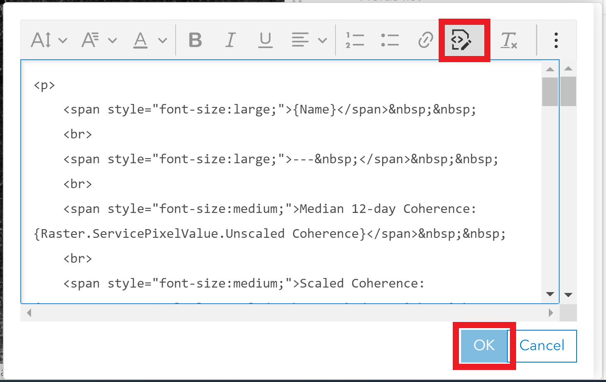
8. Click on the handle of the **Text** component and drag it above the **Fields list** component
   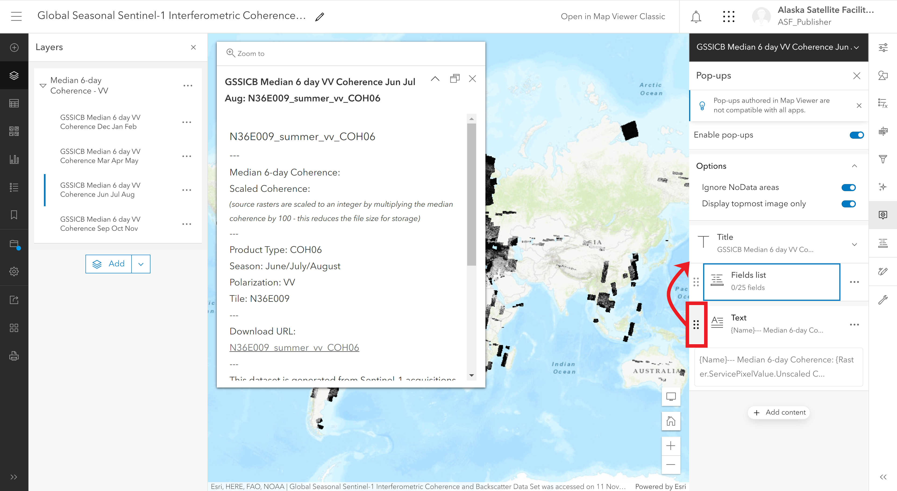
9. Save the map
10. Repeat this process for all of the layers in the map
11. Once all of the pop-ups are configured, check the performance of the pop-ups
    1. set all of the layers to be visible
    2. zoom in far enough to access the source rasters and click on a pixel
    3. scroll through the pop-ups to make sure they all display the correct content, including pixel values and hyperlinks
    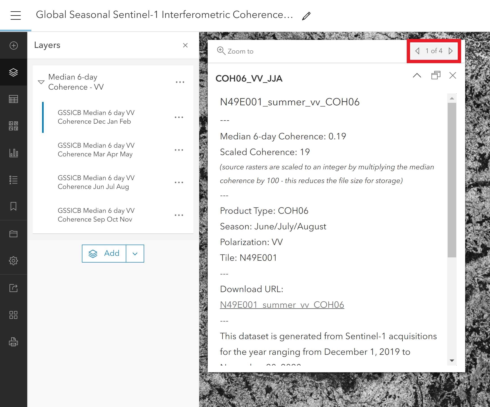
       - If the unscaled coherence values are 0 or 1 (and the scaled coherence is anything other than 0 or 100), it indicates that the numeric settings for significant digits were not successfully applied. Refer to the [Set Field Properties section](#set-field-properties) for more information.
         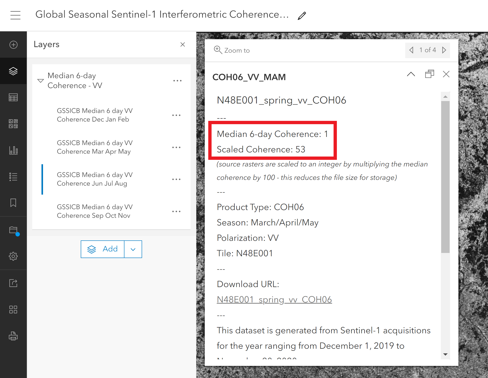

12. Zoom to a global extent, then save the map. This will set the default extent for the map.
   
## Populate Item Description for the Web Map

Before sharing the map, edit the item description in the EGIS portal to provide useful information about the contents.

1. Log in to the [EGIS Portal](https://gis.earthdata.nasa.gov/portal/home/) using the ASF_Publisher credentials
2. Search for the web map in the **Content** tab and click the link to open the Item Description for the web map
3. Click the **Edit** link for the **Description** section
   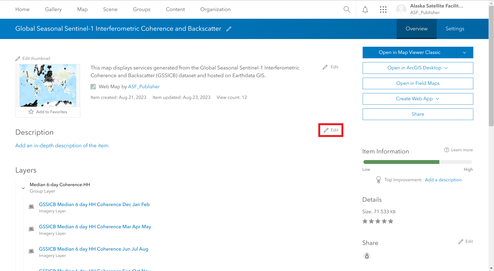
4. Enter a description of the map and its contents, then click the **Save** button
   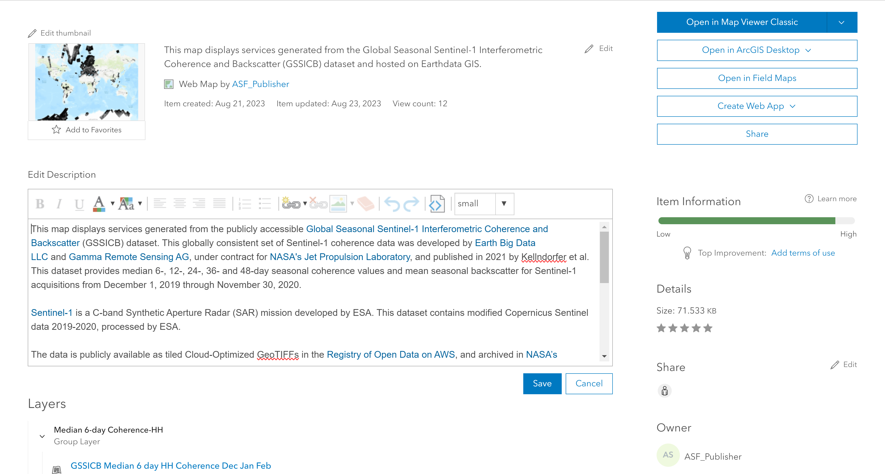
5. Scroll down the Item Description page to the **Credits** section at the bottom of the right panel, and click the **Edit** button
   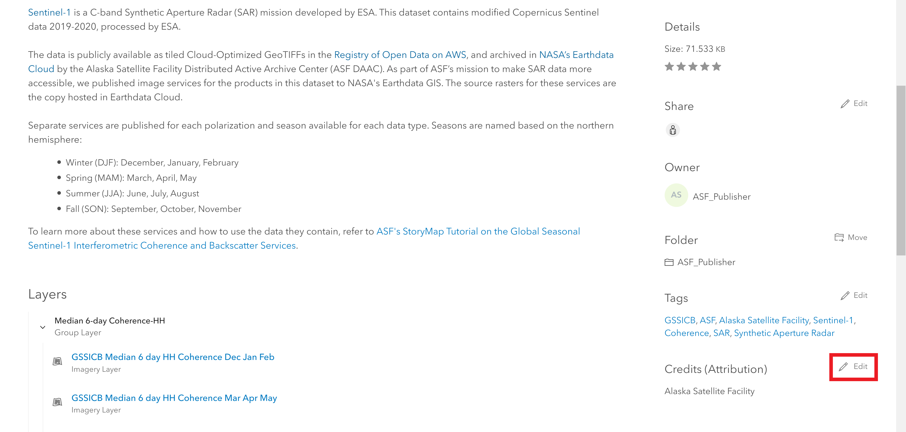
6. Enter `Alaska Satellite Facility` in the credits section. We might eventually want to add a reference to the GSSICB dataset credits, but those credits are reflected in the services themselves, so for now, we'll just go with a credit for the entity creating the map itself.

## Share a Web Map

When you create a new map, it is shared only with the owner, so only those logging in with the ASF_Publisher credentials will be able to see or edit the map. 

When the map is ready to be shared with the world, the sharing setting will need to be updated. 

1. Click the **Share map** icon in the left menu panel
   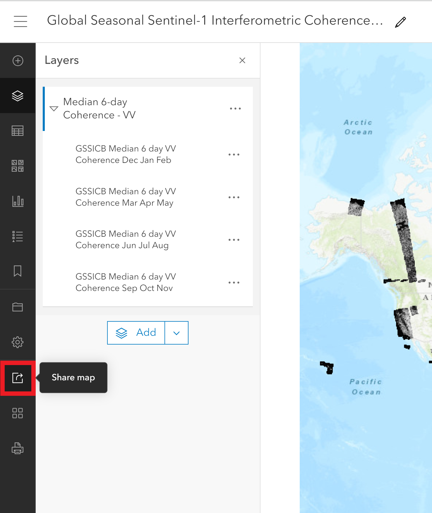
2. Select the **Organization** option from the list and click the Save button
   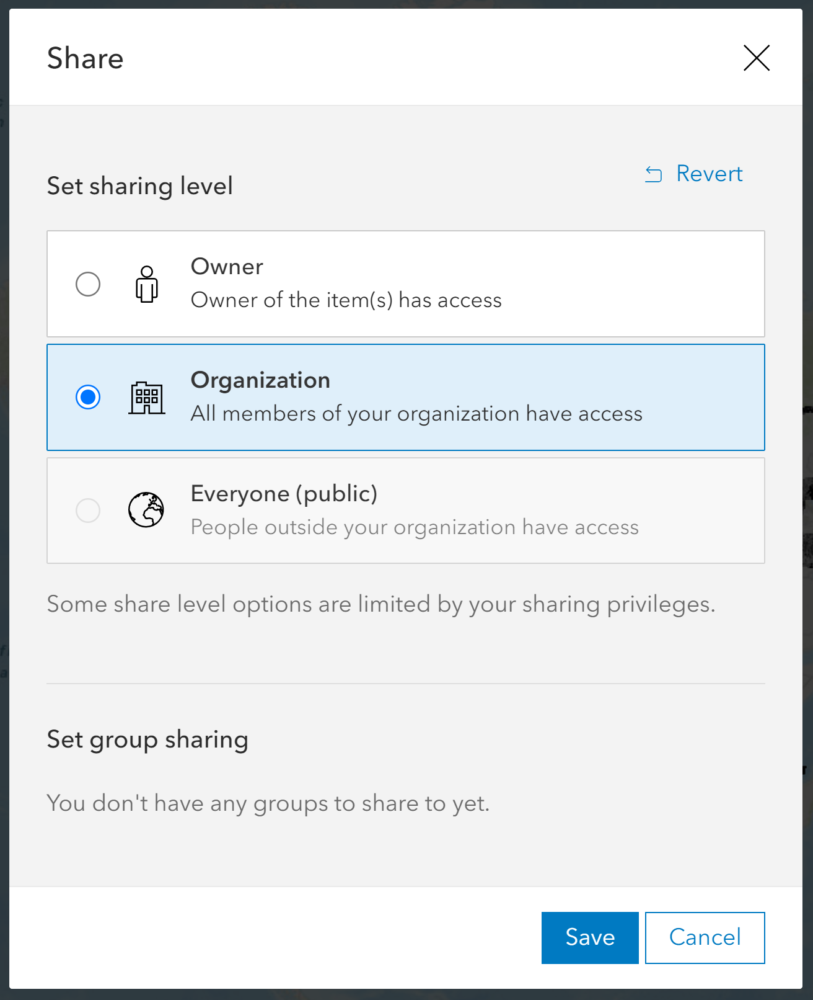
   - Note that the option to share publicly is not available in the production EGIS portal. Once the map has been shared to the Organization level, contact the EGIS team and request to start the approval process. Once the map has been determined to be suitable for publishing, the EGIS team will set the sharing level to Everyone.
