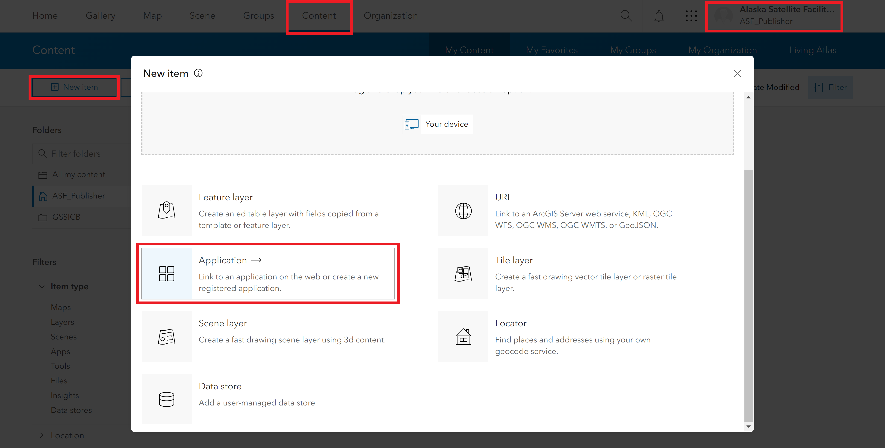
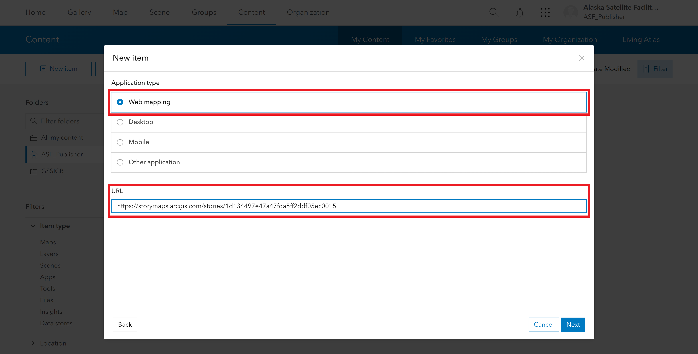

# Sharing Content to the Earthdata GIS Portal

We are able to share a variety of content to the Earthdata GIS Portal to aid in discovery. The services themselves are shared to the portal, but we can also add content such as web maps, web apps and StoryMaps, even if they are published from the ASF AGOL organization rather than directly using Earthdata GIS resources. 

The same process can be used for any of the Earthdata GIS environments (SIT, UAT, PRD):

1. Connect to the NASA VPN 
2. Open the Earthdata GIS portal in a browser, and sign in using ASF's publisher credentials
3. Select the Content tab
4. Click the New Item button
5. Click the Application button in the New Item dialog window

6. Select the Web Mapping option and paste the URL to the item into the URL field 
   * Use this same option for adding a StoryMap URL

7. Enter a name for the item, along with a description and tags, then click the Next button. 
   * You can use the same name/description/tags that was used when publishing the item originally, or adjust it as desired to be more tailored to the NASA Earthdata GIS users
   * This content can be edited in the portal later, if desired
8. Add a description for the item by clicking the Edit icon next to the Description section in the Item Description
   * The Item Description is displayed by default after you complete the New Item process
   * Alternatively, find the new item in the Content tab and click the link to view and edit the Item Description 
9. Edit any of the other sections of the Item Description, such as the Credits, as desired
10. Edit the Share settings to make the content public, and add it to the portal gallery
    1. Click the Edit button next to the Share section in the right pane of the Item Description
    2. Click the option to share the content to the Organization
    3. Contact the EGIS team to request that the content be shared with the public, and added to the Featured Apps and Gallery groups
