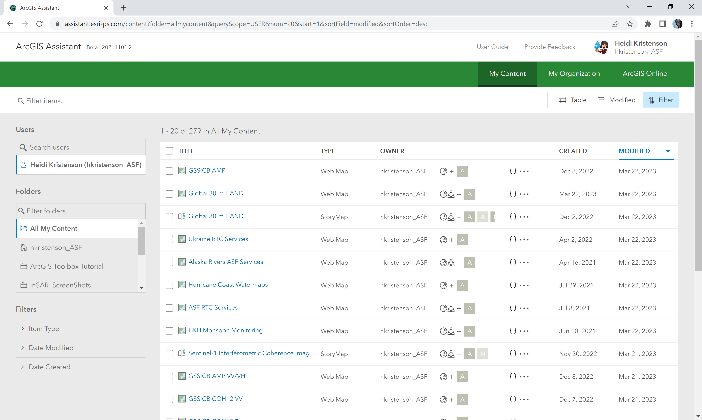
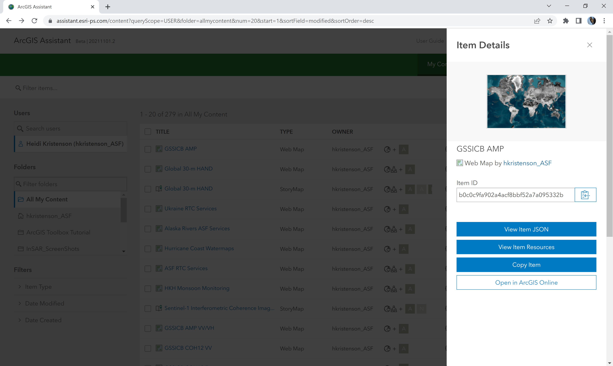
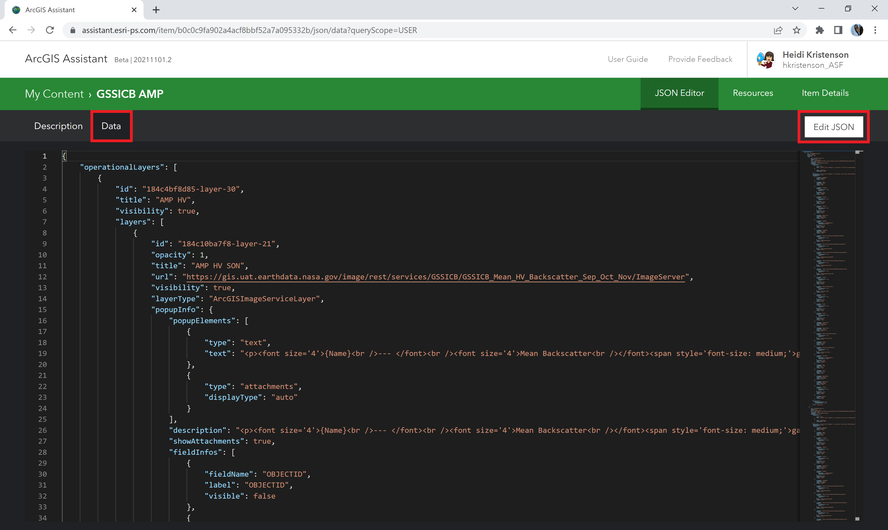
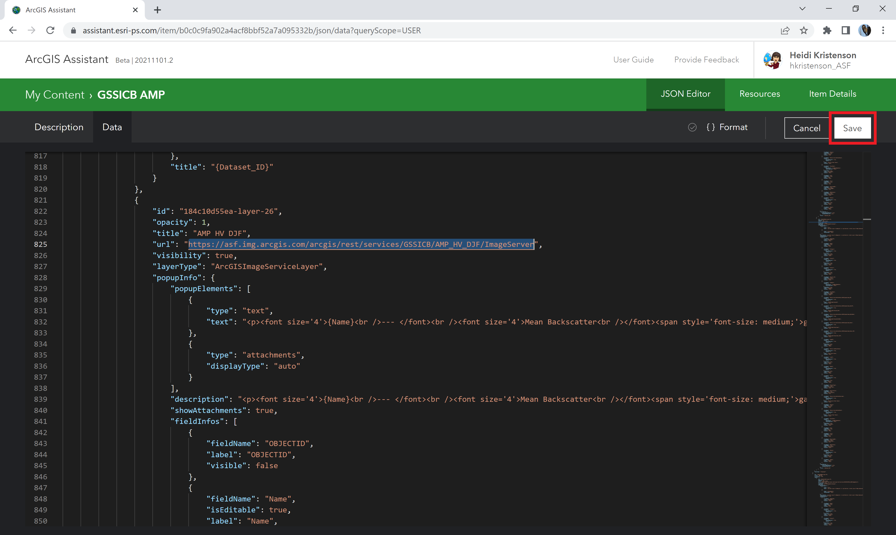

# Updating Webmap Content 

When services are moved to a different server, the webmaps and webapps that use the existing services need to be updated. 

One approach is to add the new services to the webmap, copy the pop-up formatting and content from the old service to the new, update any required changes to the format settings for fields, and check that the two layers perform the same before removing the old layer.

Another approach is to use the [ArcGIS Assistant](https://assistant.esri-ps.com/) to edit the source JSON for the webmap. If the schema of the new service is the same as the old one (same attribute fields, same raster function templates, etc.), the URL can simply be replaced for each layer included in the webmap. 

## Using the ArcGIS Assistant to Edit Service URLs

1. Open https://assistant.esri-ps.com/ in a browser window, and sign in with the credentials that allow you to edit the appropriate content.

2. Click on the title of the Web Map that needs to be updated, and click the button to View Item JSON

3. Click on the **Data** tab, and click the **Edit JSON** button

4. Edit the necessary components
   1. Each layer has a section in the JSON
   2. Change the url
   3. Change the title (if desired)
   4. Edit the content of the pop-ups (if desired)
   5. Edit field attributes if desired, such as adjusting the number of decimals displayed for a service value

5. Click the Save button to save the changes. The webmap will immediately reflect the saved changes upon refresh.
