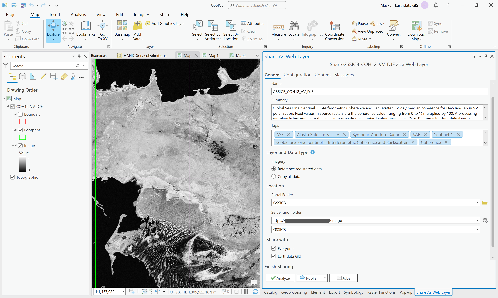
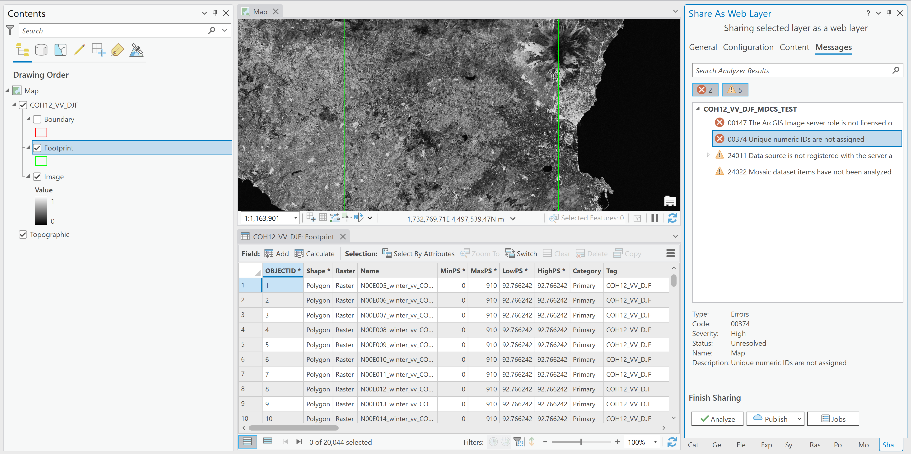

# Publishing GSSICB datasets as Image Services on Earthdata GIS

This workflow publishes services from the Global Seasonal Sentinel-1 Interferometric Coherence and Backscatter Data Set to the Earthdata GIS (EGIS) Image Server.

## Generate a Mosaic Dataset

The `make_egis_services.py` script is run programmatically on a computer with access to the arcpy python package. It generates a csv file listing all the datasets in the GSSICB AWS S3 bucket for a specified data type, then uses that csv file to build a mosaic dataset. 

**There is no need to be on the NASA VPN for this process, and it's better *not* to be if possible. The script takes much longer to run, and is more likely to encounter breaks in the connection when on the NASA VPN.**

You will need to use a terminal with access to a python environment that has both `arcpy` and `boto3` packages installed. The `arcpy` package is available through the conda environment installed with ArcGIS Pro, but that environment cannot have additional packages installed. One way to create a conda environment with both `arcpy` and `boto3` installed is to clone the `arcgispro-py3` conda environment, then conda install `boto3` to the clone environment.

The `make_egis_services.py` script requires a configuration file as input. Config files are kept in the `gis-services\image_services\egis\config` directory.

Example:
```commandline
conda activate argispro-py3-clone
cd gis-services\image_services\egis
python make_egis_services.py config\COH06_VV_DJF.json
```

## Generate the Metadata Content for the Mosaic Dataset

The `make_egis_service.py` script generates the content necessary for populating the mosaic dataset metadata. For input, it requires the same configuration file used for generating the mosaic dataset.

Example:
```commandline
cd gis-services\image_services\egis\metadata
python print_service_metadata.py ..\config\COH06_VV_DJF.json
```

It outputs a text file to the `gis-services\image_services\egis\metadata\service_metadata` directory. The sections of this text file can be copied and pasted into the metadata for the mosaic dataset in the next step.

## Edit the Metadata for the Mosaic Dataset

1. Right-click the mosaic dataset in the Catalog pane, and select Edit Metadata

2. Populate the Title, Tags, Summary, Description and Credits sections and click the Save button at the top of the window
   * Use the appropriate metadata texfile in the `gis-services\image_services\egis\metadata\service_metadata` directory to copy and paste the content for each section.

## Connect to a NASA ArcGIS Portal
Publishers must add the appropriate NASA Portal(s) to their list of portals in ArcGIS. This only needs to be done once, then the portal(s) will be available in all ArcGIS Pro projects going forward.

*The same workflow is used for publishing to the NASA SIT, UAT, and Production Portals. You will need to add a separate connection for each of these portals before you can publish to it.*

1. Open a project in ArcGIS Pro using the Map template
2. Click the Project menu and click on the Portals section
3. Click the Add Portal button
4. Enter the URL to the desired NASA portal, with /portal at the end (i.e. https://url_to_gis_server/portal/)
5. Click OK
6. Click on the options button for the portal, and choose to sign in. You will need to be on the VPN to work with this portal, including signing in.

**It's easiest to connect to the NASA VPN first before creating the ArcGIS Project you'll be using for publishing, and connect to the VPN before opening an ArcGIS Pro project where the active portal is set to the SIT environment.** If you open the project before you are connected to the NASA VPN, you will need to sign in to the portal with your credentials once you connect to the VPN.

## Publish the Mosaic Dataset as an Image Service

1. Right-click the mosaic dataset in the Catalog pane and select Share As Web Layer

2. Set the options in the General tab

   1. Set the Portal Folder to GSSICB
   2. Set the Server to https://url_to_gis_server/image (the `/image` option is not the default in the Server dropdown menu, and if this is not changed, there will be a licensing error)
   3. Set the server Folder to GSSICB
   4. Select Everyone and Earthdata GIS under the Share options
      * **For the production server, the Everyone option is not available to us. Select the Organization option, and contact the EGIS team to request that they share the service publicly.**
3. Set the options in the Configuration tab

   1. Check the box next to WMS under the Additional Layers section
      * **For the production server, this option is not available to us. The WMS option requires that the service be shared publicly, and we are not authorized to share publicly. Once the service has been published, contact the EGIS team to request that they enable the WMS option.**
4. Click the Analyze button
   1. There is the possibility that a number of errors and warnings will be identified.

      1. The licensing error occurs when the server option has not been changed to the /image option in the dropdown menu
      2. The first time you use a Map to view one of these mosaics, you may need to set the Map Properties to allow for unique IDs to be applied to the layer. If this error is displayed, hover over it and click the ... button. Select the option to Open Map Properties To Allow Assignment. On the Map Properties dialog box, on the General tab, check Allow assignment of unique numeric IDs for sharing web layers and click OK. 
      3. The data source is recognized as not being in a registered location, and will warn that the data will be copied to the server. This is fine. It's not copying all the source rasters, but just the metadata and other necessary data.
      4. Mosaic dataset items are not analyzed. This is also okay.
   2. If there are errors identified, they must be fixed before publishing is possible. Warnings do not need to be fixed (unless it identifies something that should be addressed, like missing metadata, etc.)
5. Click the Publish button
6. It will take a while to stage and publish the service
7. Once the publishing process is complete, the service will be listed in the portal in the Content tab, inside the GSSICB folder.
   1. The item description contains all the metadata set in ArcGIS Pro. There's a link under the Layer section that takes you to the REST Endpoint metadata page.

