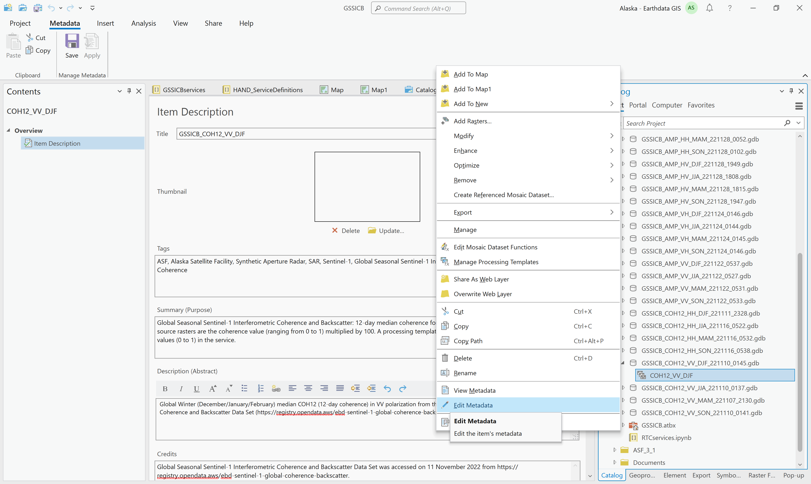
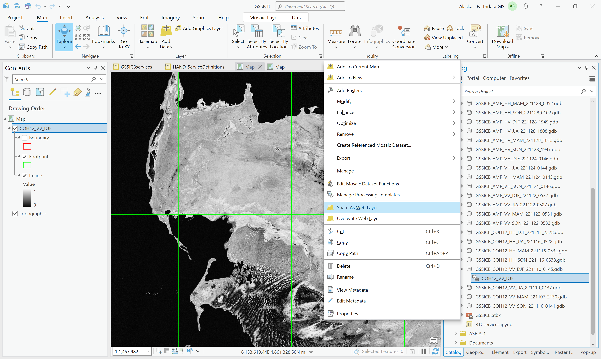
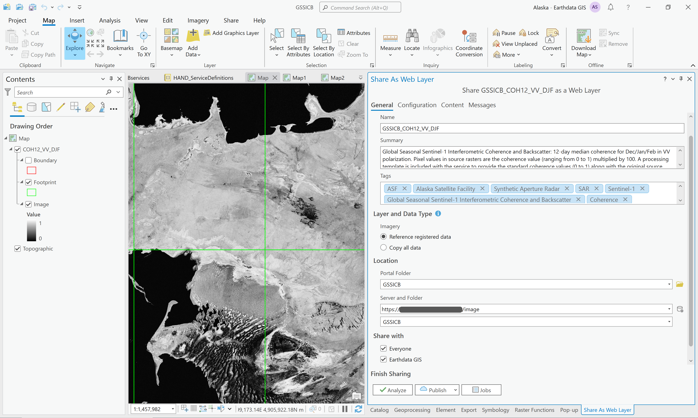
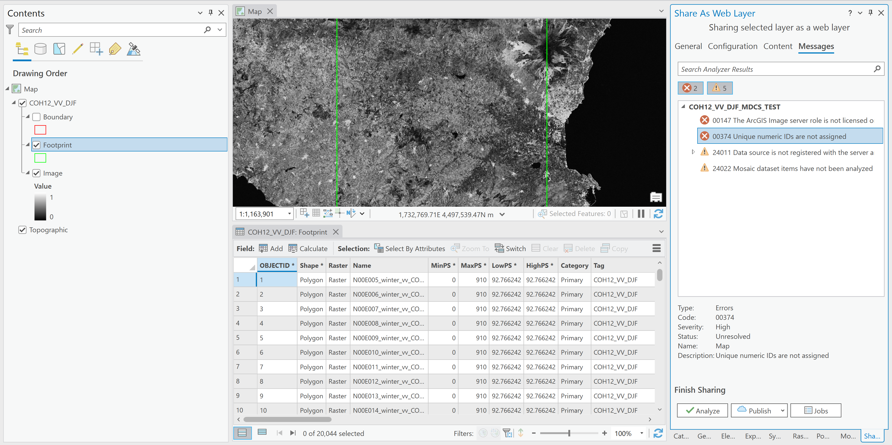

# Publishing MDCS-generated Mosaic Datasets as Image Services on Earthdata GIS

*This workflow is done in ArcGIS Pro 3.1*

## Connect to NASA SIT ArcGIS Portal
Publishers must add the NASA SIT Portal to their list of portals in ArcGIS. This only needs to be done once.

1. Open a project in ArcGIS Pro using the Map template
2. Click the Project menu and click on the Portals section
3. Click the Add Portal button
4. Enter the URL to the desired NASA portal, with /portal at the end (i.e. https://url_to_gis_server/portal/)
5. Click OK
6. Click on the options button for the portal, and choose to sign in. You will need to be on the VPN to work with this portal, including signing in.

**It's easiest to connect to the NASA VPN first before creating the ArcGIS Project you'll be using for publishing, and always connect to the VPN before opening that project going forward.**

## Publish a Service

1. Navigate to the geodatabase with the mosaic dataset in the Catalog pane in ArcGIS Pro
2. Expand the geodatabase to view the mosaic dataset
3. Drag the mosaic dataset into the map view and verify that it behaves as expected
4. Right-click the mosaic dataset in the Catalog pane, and select Edit Metadata

5. Populate the Title, Tags, Summary, Description and Credits sections and click the Save button at the top of the window
6. Right-click the mosaic dataset in the Catalog pane and select Share As Web Layer

7. Select the options in the General tab

   1. Set the Portal Folder to GSSICB
   2. Set the Server to https://url_to_gis_server/image (this is not the default in the Server dropdown menu, and if this is not changed, there will be a licensing error)
   3. Set the server Folder to GSSICB
   4. Select Earthdata GIS under the Share options
8. Click the Analyze button
   1. There is the possibility that a number of errors and warnings will be identified.

      1. The licensing error occurs when the server option has not been changed to the /image option in the dropdown menu
      2. The first time you use a Map to view one of these mosaics, you may need to set the Map Properties to allow for unique IDs to be applied to the layer. If this error is displayed, hover over it and click the ... button. Select the option to Open Map Properties To Allow Assignment. On the Map Properties dialog box, on the General tab, check Allow assignment of unique numeric IDs for sharing web layers and click OK. 
      3. The data source is recognized as not being in a registered location, and will warn that the data will be copied to the server. This is fine. It's not copying all the source rasters, but just the metadata and other necessary data.
      4. Mosaic dataset items are not analyzed. This is also okay.
   2. If there are errors identified, they must be fixed before publishing is possible. Warnings do not need to be fixed (unless it identifies something that should be addressed, like missing metadata, etc.)
9. Click the Publish button
   1. It will take a while to stage and publish the service
10. Once the publishing process is complete, the service will be listed in the portal in the Content tab, inside the GSSICB folder.
    1. The item description contains all the metadata set in ArcGIS Pro. There's a link under the Layer section that takes you to the REST Endpoint metadata page.