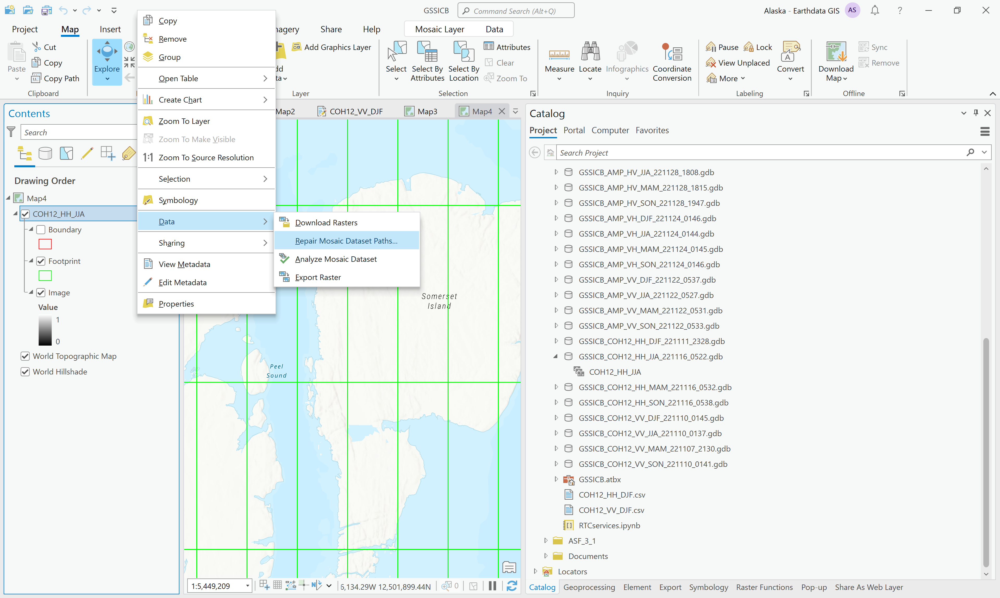
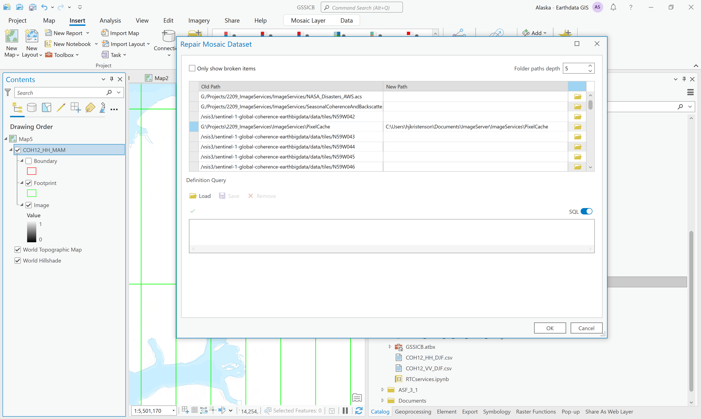
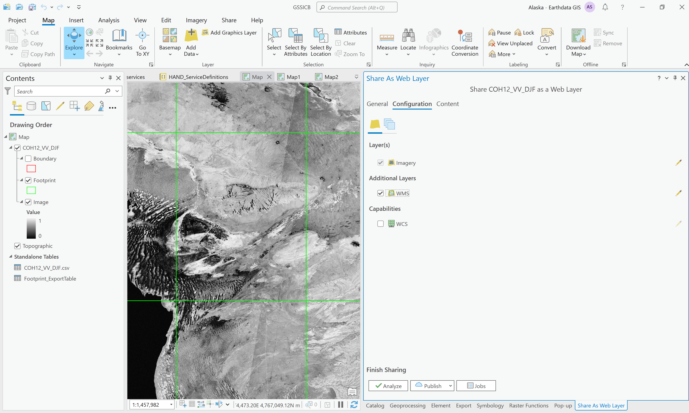

# Publishing MDCS-generated Mosaic Datasets as Image Services on Earthdata GIS

*This workflow is done in ArcGIS Pro 3.1*

## Connect to NASA SIT ArcGIS Portal
Publishers must add the NASA SIT Portal to their list of portals in ArcGIS. This only needs to be done once.

1. Open a project in ArcGIS Pro using the Map template
2. Click the Project menu and click on the Portals section
3. Click the Add Portal button
4. Enter the URL to the desired NASA portal, with /portal at the end (i.e. https://url_to_gis_server/portal/)
5. Click OK
6. Click on the options button for the portal, and choose to sign in. You will need to be on the VPN to work with this portal, including signing in.

**It's easiest to connect to the NASA VPN first before creating the ArcGIS Project you'll be using for publishing, and always connect to the VPN before opening that project going forward when the active portal is set to the SIT environment.**

*The same workflow is used for publishing to the NASA UAT Portal; simply connect to the NASA UAT portal in ArcGIS Pro rather than the NASA SIT Portal.*

## Verify that the Mosaic Dataset paths are correct

1. Navigate to the geodatabase with the mosaic dataset in the Catalog pane in ArcGIS Pro
2. Expand the geodatabase to view the mosaic dataset
3. Drag the mosaic dataset into the map view and verify that it behaves as expected
   1. In many cases, the overviews will display correctly and the attribute table contains records for all of the source rasters, but the source rasters do not render. Zoom in to a single source raster, and make sure that it renders at all zoom levels.
   2. If the source rasters render appropriately, skip the next step and proceed to editing the metadata

## Repair Mosaic Dataset Pixel Cache Path (IF NECESSARY)

If the source rasters do not render correctly, try repairing the path to the pixel cache in the mosaic dataset.

For some services published using MDCS (or subsequently repaired), a specific path is defined for the pixel cache, which makes it easy to identify the directory involving the pixel cache and replacing its path with a directory path on the computer being used to publish the image service. 

In other cases, if the pixel cache location was either defined using relative paths or has already been repaired, the path may be a generically named directory.

The easiest scenario is illustrated below, but refer to the [Pixel Cache Path Exceptions](#pixel-cache-path-exceptions) box afterwards for more information about difficulties and specific conditions that may be encountered during this process.

1. Create a directory on your local computer named "PixelCache"
2. Right-click on the Mosaic Dataset in the Table of Contents and select Data > Repair Mosaic Dataset Paths

3. Scroll to the path to the PixelCache directory, and replace it with the path for the PixelCache directory on your local computer

4. Click OK to exit the dialog

> ## ⚠ PIXEL CACHE PATH REPAIR
>### Pixel Cache Path Exceptions
>
>If using the GSSICB files archived in s3://asf-gis-services/GSSICB/, there are three different paths used to repair the Pixel Cache path: 
> 
>* C:\Users\Administrator\Documents\ArcGIS
>* C:\Users\asjohnston\Desktop\image_server
>* C:\Users\hjkristenson\Documents\ImageServer
>
>In general, the path involving the pixel cache is the 4th entry in the list of paths, but it's unclear if that is always the case. If in doubt, you can also click the check-box to only display broken paths, which will reduce the number of options. 
> 
> While other paths in the list may be broken, the only one that requires a fix in this workflow is the one that impacts the pixel cache. It is not, however, problematic to set all of the broken file paths to local paths if you are not sure which one requires the change.
>
>Note that the repaired paths may not include the PixelCache designation in the path following the repair, but rather truncate the listed path to a parent directory beyond which the paths match. 
> 
>For example, the repairs illustrated in step 3 above did not retain the full path after the repairs were complete; the path listed in the mosaic dataset includes only the portion of the path that didn't originally match:
>
>- Old path: `G:\Projects\2209_ImageServices\ImageServices\PixelCache`
>- New path: `C:\Users\hjkristenson\Documents\ImageServer\ImageServices\PixelCache`
>- Path currently displayed: `C:\Users\hjkristenson\Documents\ImageServer\ `
>
>If using GSSICB files from the original source computer, there are two scenarios: 
>1. COH12_VV services use relative paths, so the directory to repair is `C:\Users\hjkristenson\PycharmProjects\hyp3-nasa-disasters`
>   * You can use any path on your local computer to replace the broken path, but be aware that a folder structure will be generated to next within it to mirror the original directory structure, including subdirectories in the hyp3-nasa-disasters directory, ending with a PixelCache directory
>2. All of the other GSSICB services use the following path for the pixel cache: `G:\Projects\2209_ImageServices\ImageServices\PixelCache`
>   * In this case, it's easiest to set a local path that ends in a PixelCache directory

## Edit the Metadata for the Mosaic Dataset

1. Right-click the mosaic dataset in the Catalog pane, and select Edit Metadata

2. Populate the Title, Tags, Summary, Description and Credits sections and click the Save button at the top of the window
   * Refer to the sample metadata files for the [COH12](sample_metadata_COH12.txt) and [AMP](sample_metadata_AMP.txt) datasets for content

## Publish the Mosaic Dataset as an Image Service

1. Right-click the mosaic dataset in the Catalog pane and select Share As Web Layer

2. Set the options in the General tab

   1. Set the Portal Folder to GSSICB
   2. Set the Server to https://url_to_gis_server/image (this is not the default in the Server dropdown menu, and if this is not changed, there will be a licensing error)
   3. Set the server Folder to GSSICB
   4. Select Everyone and Earthdata GIS under the Share options
3. Set the options in the Configuration tab

   1. Check the box next to WMS under the Additional Layers section
4. Click the Analyze button
   1. There is the possibility that a number of errors and warnings will be identified.

      1. The licensing error occurs when the server option has not been changed to the /image option in the dropdown menu
      2. The first time you use a Map to view one of these mosaics, you may need to set the Map Properties to allow for unique IDs to be applied to the layer. If this error is displayed, hover over it and click the ... button. Select the option to Open Map Properties To Allow Assignment. On the Map Properties dialog box, on the General tab, check Allow assignment of unique numeric IDs for sharing web layers and click OK. 
      3. The data source is recognized as not being in a registered location, and will warn that the data will be copied to the server. This is fine. It's not copying all the source rasters, but just the metadata and other necessary data.
      4. Mosaic dataset items are not analyzed. This is also okay.
   2. If there are errors identified, they must be fixed before publishing is possible. Warnings do not need to be fixed (unless it identifies something that should be addressed, like missing metadata, etc.)
5. Click the Publish button
6. It will take a while to stage and publish the service
7. Once the publishing process is complete, the service will be listed in the portal in the Content tab, inside the GSSICB folder.
   1. The item description contains all the metadata set in ArcGIS Pro. There's a link under the Layer section that takes you to the REST Endpoint metadata page.

## Archive the Geodatabase

Once the metadata has been added to the mosaic dataset, it should be zipped and uploaded to our [S3 Bucket](https://asf-gis-services.s3.us-west-2.amazonaws.com/GSSICB/)

## Republish a Service from an Archived Geodatabase

If the service needs to be republished, download the zipped gdb from the S3 bucket, unzip it, and follow the steps above, as necessary. 